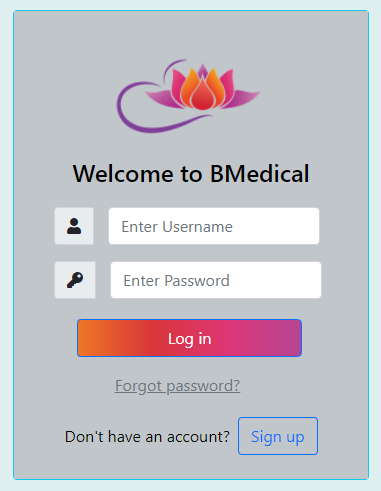
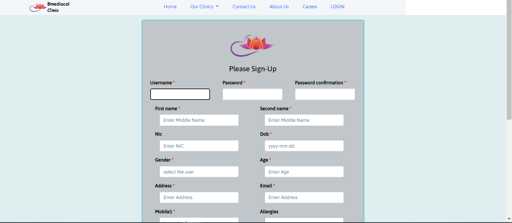
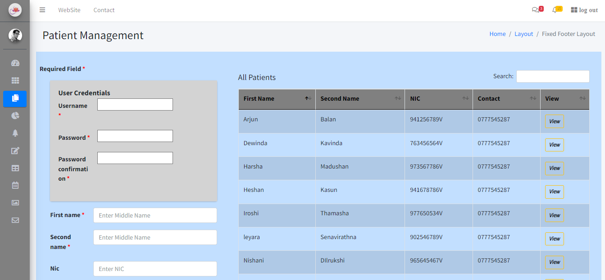
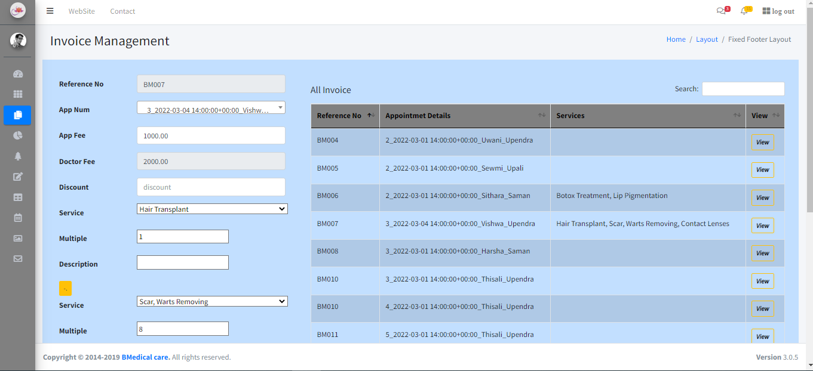
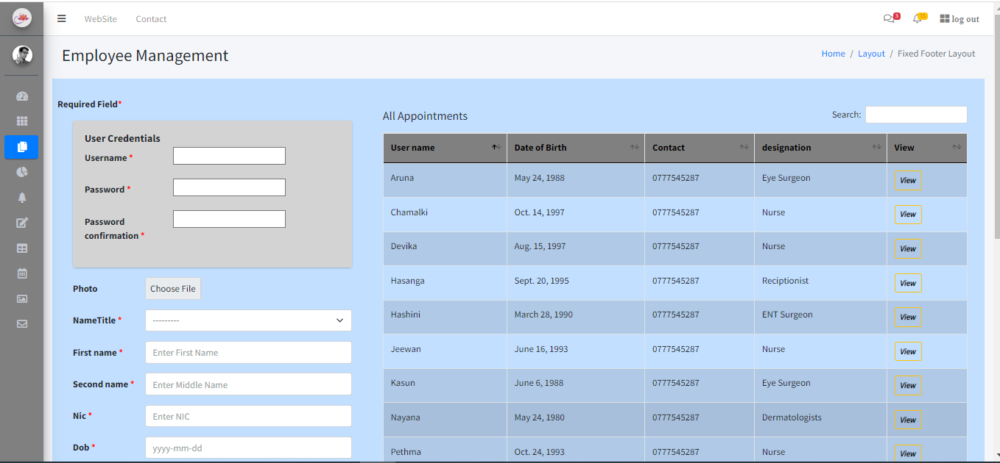

# HealthHaven 🏥

**HealthHaven** is a modern and efficient **Clinic Management System** designed to streamline patient records, appointments, billing, and more. With a user-friendly interface and robust features, it simplifies healthcare administration for clinics and hospitals.

## 🚀 Features  
- **Patient Management**: Securely store and manage patient records.  
- **Appointment Scheduling**: Easily schedule, reschedule, and cancel appointments.  
- **Billing & Invoicing**: Generate invoices and manage payments seamlessly.  
- **Doctor & Staff Management**: Maintain records of doctors, nurses, and other medical personnel.  
- **Medical Records**: Store prescriptions, medical histories, and lab reports.  
- **User Authentication**: Secure login system with role-based access (Admin, Doctor, Receptionist, etc.).  
- **Reports & Analytics**: Generate insightful reports to optimize clinic operations.  

## 🛠️ Tech Stack  
- **Backend**: Python (Django)  
- **Frontend**: JavaScript, jQuery, Bootstrap, CSS  
- **Database**: SQLite  
- **APIs**: Google API  
- **Deployment**: Batch file for easy project startup  

## 📦 Installation  

1. **Clone the repository:**  
   ```bash
   git clone https://github.com/yourusername/HealthHaven.git
   cd HealthHaven
   ```  

2. **Set up a virtual environment and install dependencies:**  
   ```bash
   python -m venv venv
   source venv/bin/activate  # On Windows use: venv\Scripts\activate
   pip install -r requirements.txt
   ```  

3. **Apply database migrations:**  
   ```bash
   python manage.py migrate
   ```  

4. **Create a superuser (optional, for admin access):**  
   ```bash
   python manage.py createsuperuser
   ```  

5. **Run the project using the batch file:**  
   ```bash
   start_project.bat
   ```  

## 📷 Screenshots  
Here are some screenshots of the application:

  
*Login Interface*  

  
*Signup Interface*  

  
*Patient Management Section*  

  
*Invoices Management*  

  
*Employee Details Section*  

## 🤝 Contributing  
We welcome contributions! Follow these steps:  
1. **Fork** the repository.  
2. **Create** a new feature branch:  
   ```bash
   git checkout -b feature-name
   ```  
3. **Commit** your changes:  
   ```bash
   git commit -m "Add new feature"
   ```  
4. **Push** to the branch:  
   ```bash
   git push origin feature-name
   ```  
5. **Submit a Pull Request** for review.  

## 📜 License  
This project is licensed under the **MIT License** – see the [LICENSE](LICENSE) file for details.  

